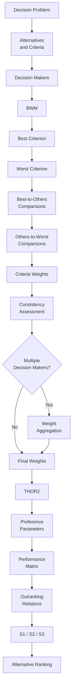

# BWM–THOR2

[](https://www.python.org/)


**A Hybrid Architecture for Multicriteria Decision Aid**

**English** | [Português](README.pt-BR.md) 

---

## Overview

**BWM–THOR2** is a hybrid multicriteria decision-aiding architecture that integrates the **Best–Worst Method (BWM)** for criteria weighting with **THOR2** for alternative evaluation and ranking.

The approach establishes a structured workflow connecting preference elicitation, criteria weighting, group decision-making, and outranking-based alternative evaluation.

This repository contains the computational implementation developed as part of an undergraduate thesis in Production Engineering at **CEFET/RJ – UnED Itaguaí, Brazil**.

> **Thesis:** *BWM–THOR2: Formalização, Implementação Computacional e Avaliação de uma Arquitetura Híbrida para Apoio Multicritério à Decisão*

---

## Method Architecture


The architecture is composed of two main stages:

### 1. Criteria weighting — BWM

The **Best–Worst Method** is used to elicit the relative importance of the criteria from decision-maker preferences.

The procedure includes:

- identification of the best criterion;
- identification of the worst criterion;
- Best-to-Others comparisons;
- Others-to-Worst comparisons;
- optimization of criteria weights;
- consistency assessment.

### 2. Alternative evaluation — THOR2

The resulting criteria weights are used by **THOR2**, an outranking-based multicriteria method that evaluates the relationships between alternatives considering preference parameters and decision thresholds.

The implementation supports the THOR2 scenarios:

- **S1**
- **S2**
- **S3**

---

## Features

- Multiple alternatives and criteria
- Multiple decision makers
- Best–Worst Method weighting
- Best-to-Others comparisons
- Others-to-Worst comparisons
- BWM consistency evaluation
- Group weight aggregation
- Preference and indifference thresholds
- Discordance parameters
- Membership values
- Performance matrix definition
- Pairwise preference relations
- THOR2 scenarios S1, S2 and S3
- Alternative ranking
- Graphical user interface

---

## Technologies

| Technology | Purpose |
|---|---|
| Python | Core implementation |
| FreeSimpleGUI | Graphical user interface |
| NumPy | Numerical operations |
| SciPy | BWM optimization |
| Matplotlib | Result visualization |

---

## Repository Structure

```text
bwm-thor2/
│
├── bwm_thor2.py
├── requirements.txt
├── README.md
├── README.pt-BR.md
├── CITATION.cff
└── .gitignore
```

---

## Installation

Clone the repository:

```bash
git clone https://github.com/Rhenan01/bwm-thor2.git
cd bwm-thor2
```

Create a virtual environment:

```bash
python -m venv .venv
```

Activate it on Windows:

```bash
.venv\Scripts\activate
```

On Linux/macOS:

```bash
source .venv/bin/activate
```

Install the dependencies:

```bash
pip install -r requirements.txt
```

Run the application:

```bash
python bwm_thor2.py
```

---

## Academic Context

This implementation is part of the undergraduate thesis:

> **BWM–THOR2: Formalização, Implementação Computacional e Avaliação de uma Arquitetura Híbrida para Apoio Multicritério à Decisão**

**Author:** Rhenan Silva dos Santos  
**Program:** Production Engineering  
**Institution:** Centro Federal de Educação Tecnológica Celso Suckow da Fonseca — CEFET/RJ  
**Campus:** UnED Itaguaí  
**Advisor:** Prof. Fabricio Maione Tenório, D.Sc.

The research focuses on the formalization, computational implementation, and evaluation of the BWM–THOR2 architecture as a hybrid approach for multicriteria decision aid.

---

## Main References

- REZAEI, J. Best-worst multi-criteria decision-making method. *Omega*, 53, 49–57, 2015.
- REZAEI, J. Best-worst multi-criteria decision-making method: Some properties and a linear model. *Omega*, 64, 126–130, 2016.
- LIANG, F.; BRUNELLI, M.; REZAEI, J. Consistency issues in the best worst method: Measurements and thresholds. *Omega*, 96, 102175, 2020.
- TENÓRIO, F. M. et al. THOR 2 method: An efficient instrument in situations where there is uncertainty or lack of data. *IEEE Access*, 9, 161794–161805, 2021.

---

## Citation

Citation information for the BWM–THOR2 architecture will be updated after publication of the associated academic work.

For the current computational implementation, see [`CITATION.cff`](CITATION.cff).

---

## Project Status

> **Under development**

BWM–THOR2 is currently under development and academic evaluation.

The mathematical formulation, computational implementation, documentation, and evaluation procedures may change until the final version of the research is completed.