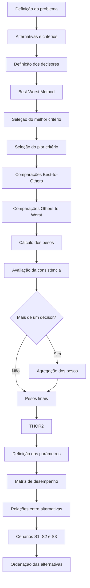

# BWM–THOR2

[](https://www.python.org/)


**Uma Arquitetura Híbrida para Apoio Multicritério à Decisão**

[English](README.md) | **Português**

---

## Visão geral

O **BWM–THOR2** é uma arquitetura híbrida de apoio multicritério à decisão que integra o **Best–Worst Method (BWM)** para determinação dos pesos dos critérios ao **THOR2** para avaliação e ordenação das alternativas.

A proposta estabelece um fluxo estruturado entre a elicitação das preferências dos decisores, a ponderação dos critérios e a avaliação das alternativas por meio de relações de sobreclassificação.

Este repositório contém a implementação computacional desenvolvida no contexto do Trabalho de Conclusão de Curso em Engenharia de Produção do **Centro Federal de Educação Tecnológica Celso Suckow da Fonseca — CEFET/RJ, UnED Itaguaí**.

> **TCC:** *BWM–THOR2: Formalização, Implementação Computacional e Avaliação de uma Arquitetura Híbrida para Apoio Multicritério à Decisão*

---

## Arquitetura do método

O BWM–THOR2 é composto por duas etapas principais:

1. **ponderação dos critérios por meio do BWM**;
2. **avaliação e ordenação das alternativas por meio do THOR2**.

O fluxo geral da arquitetura pode ser representado por:



---

## Best–Worst Method

O **Best–Worst Method (BWM)** é utilizado para determinar a importância relativa dos critérios a partir das preferências informadas pelo decisor.

Para cada decisor são definidos:

- o critério considerado mais importante (**Best**);
- o critério considerado menos importante (**Worst**);
- as preferências do melhor critério em relação aos demais;
- as preferências dos demais critérios em relação ao pior.

### Comparações Best-to-Others

O vetor de preferência do melhor critério em relação aos demais é definido por:

$$
A_B = (a_{B1}, a_{B2}, \ldots, a_{Bn})
$$

em que $a_{Bj}$ representa a preferência do melhor critério $B$ em relação ao critério $j$.

### Comparações Others-to-Worst

O vetor de preferência dos critérios em relação ao pior critério é definido por:

$$
A_W = (a_{1W}, a_{2W}, \ldots, a_{nW})
$$

em que $a_{jW}$ representa a preferência do critério $j$ em relação ao pior critério $W$.

A partir dessas comparações, o problema de otimização do BWM determina o vetor de pesos:

$$
W = (w_1, w_2, \ldots, w_n)
$$

sujeito à condição de normalização:

$$
\sum_{j=1}^{n} w_j = 1
$$

e à restrição:

$$
w_j \geq 0
$$

A implementação computacional utiliza programação linear por meio do módulo `scipy.optimize`.

Além dos pesos dos critérios, o programa obtém o valor associado à consistência da solução do BWM.

---

## Decisão em grupo

A implementação permite trabalhar com um ou mais decisores.

Cada decisor realiza individualmente o processo de elicitação do BWM, incluindo:

1. escolha do melhor critério;
2. escolha do pior critério;
3. comparações Best-to-Others;
4. comparações Others-to-Worst;
5. obtenção do vetor individual de pesos.

Quando existem múltiplos decisores, os vetores individuais são agregados antes da aplicação do THOR2.

Para um determinado critério $j$, o peso agregado é calculado por meio da média geométrica:

$$
\widetilde{w}_j =
\left(
\prod_{r=1}^{R} w_{jr}
\right)^{1/R}
$$

em que:

- $R$ representa o número de decisores;
- $w_{jr}$ representa o peso do critério $j$ obtido para o decisor $r$.

Posteriormente, os valores agregados são normalizados:

$$
w_j =
\frac{\widetilde{w}_j}
{\sum_{k=1}^{n}\widetilde{w}_k}
$$

O vetor resultante de pesos é utilizado como entrada na etapa THOR2.

---

## THOR2

Após a determinação dos pesos dos critérios, o programa executa a etapa de avaliação das alternativas por meio do **THOR2**.

O THOR2 pertence à família dos métodos multicritério baseados em relações de sobreclassificação e permite estruturar comparações entre alternativas considerando os parâmetros definidos para cada critério.

Entre os elementos utilizados pela implementação estão:

- pesos dos critérios;
- limiares de preferência;
- limiares de indiferença;
- parâmetros de discordância;
- valores de pertinência, quando aplicáveis;
- matriz de desempenho das alternativas.

### Relações de preferência

Para duas alternativas $a$ e $b$, diferentes relações podem ser estabelecidas para cada critério.

| Relação | Interpretação |
|---|---|
| `aPb` | $a$ é estritamente preferível a $b$ |
| `aQb` | $a$ apresenta preferência fraca em relação a $b$ |
| `aIb` | $a$ é indiferente a $b$ |
| `bIa` | $b$ é indiferente a $a$ |
| `bQa` | $b$ apresenta preferência fraca em relação a $a$ |
| `bPa` | $b$ é estritamente preferível a $a$ |

Essas relações são combinadas aos pesos dos critérios e aos parâmetros definidos pelo decisor para a construção das relações de sobreclassificação.

### Cenários do THOR2

A implementação considera os três cenários de análise do THOR2:

- **S1**
- **S2**
- **S3**

Os diferentes cenários estabelecem condições distintas para a comparação das alternativas e permitem avaliar o comportamento da ordenação diante das relações de preferência identificadas.

---

## Funcionalidades

A versão atual da implementação permite:

- definir o número de alternativas;
- definir o número de critérios;
- definir o número de decisores;
- nomear alternativas e critérios;
- selecionar os critérios Best e Worst;
- realizar comparações Best-to-Others;
- realizar comparações Others-to-Worst;
- calcular os pesos dos critérios pelo BWM;
- avaliar a consistência dos julgamentos;
- trabalhar com múltiplos decisores;
- agregar os vetores de pesos dos decisores;
- normalizar os pesos agregados;
- configurar os parâmetros utilizados pelo THOR2;
- definir limiares de preferência;
- definir limiares de indiferença;
- configurar parâmetros de discordância;
- utilizar valores de pertinência;
- inserir a matriz de desempenho das alternativas;
- estabelecer relações de preferência entre alternativas;
- executar os cenários S1, S2 e S3;
- calcular as avaliações das alternativas;
- apresentar os resultados por meio de interface gráfica.

---

## Interface gráfica

A implementação possui uma interface gráfica que conduz o usuário pelas diferentes etapas de aplicação do BWM–THOR2.

O fluxo principal da aplicação é:

```text
Definição do problema
        │
        ▼
Alternativas e critérios
        │
        ▼
Definição dos decisores
        │
        ▼
Seleção Best e Worst
        │
        ▼
Comparações do BWM
        │
        ▼
Cálculo dos pesos
        │
        ▼
Avaliação da consistência
        │
        ▼
Agregação dos decisores
        │
        ▼
Parâmetros do THOR2
        │
        ▼
Matriz de desempenho
        │
        ▼
Relações entre alternativas
        │
        ▼
Cenários S1, S2 e S3
        │
        ▼
Resultados e ordenação
```

---

## Tecnologias utilizadas

A aplicação foi desenvolvida em **Python**.

As principais tecnologias utilizadas atualmente são:

| Tecnologia | Utilização |
|---|---|
| **Python** | implementação principal da aplicação |
| **FreeSimpleGUI** | construção da interface gráfica |
| **NumPy** | operações numéricas e manipulação de estruturas de dados |
| **SciPy** | resolução do problema de otimização do BWM |
| **Matplotlib** | geração e visualização de resultados |

As dependências necessárias para execução estão disponíveis no arquivo [`requirements.txt`](requirements.txt).

---

## Estrutura do repositório

A estrutura atual do projeto é:

```text
bwm-thor2/
│
├── bwm_thor2.py
├── requirements.txt
├── README.md
├── README.pt-BR.md
├── CITATION.cff
└── .gitignore
```

### `bwm_thor2.py`

Arquivo principal da aplicação.

Atualmente concentra:

- interface gráfica;
- entrada e validação dos dados;
- implementação computacional do BWM;
- cálculo dos pesos dos critérios;
- tratamento de múltiplos decisores;
- agregação dos pesos;
- implementação computacional do THOR2;
- definição das relações de preferência;
- execução dos cenários S1, S2 e S3;
- processamento dos resultados.

### `requirements.txt`

Contém as dependências necessárias para execução do projeto.

### `README.md`

Documentação principal do repositório em inglês.

### `README.pt-BR.md`

Documentação do projeto em português brasileiro.

### `CITATION.cff`

Contém os metadados utilizados para referência acadêmica do software.

### `.gitignore`

Define arquivos e diretórios locais que não devem ser versionados pelo Git, como ambientes virtuais, caches e arquivos temporários.

---

## Instalação

### Pré-requisitos

Para executar a aplicação, é necessário possuir:

- [Python](https://www.python.org/)
- [Git](https://git-scm.com/)

---

### 1. Clonar o repositório

```bash
git clone https://github.com/Rhenan01/bwm-thor2.git
cd bwm-thor2
```

---

### 2. Criar um ambiente virtual

É recomendado utilizar um ambiente virtual para manter as dependências do projeto isoladas.

#### Windows

```bash
python -m venv .venv
```

Ative o ambiente:

```bash
.venv\Scripts\activate
```

#### Linux/macOS

```bash
python3 -m venv .venv
```

Ative o ambiente:

```bash
source .venv/bin/activate
```

Após a ativação, o terminal deverá apresentar algo semelhante a:

```text
(.venv)
```

---

### 3. Atualizar o pip

```bash
python -m pip install --upgrade pip
```

---

### 4. Instalar as dependências

```bash
pip install -r requirements.txt
```

---

### 5. Executar a aplicação

```bash
python bwm_thor2.py
```

A interface gráfica do BWM–THOR2 será iniciada.

---

## Dados de entrada

Para executar um problema multicritério, o usuário deverá fornecer informações relacionadas à estrutura do problema e às preferências dos decisores.

### Definição do problema

- número de alternativas;
- número de critérios;
- número de decisores;
- nomes das alternativas;
- nomes dos critérios.

### Etapa BWM

Para cada decisor:

- melhor critério;
- pior critério;
- preferências Best-to-Others;
- preferências Others-to-Worst.

### Etapa THOR2

- pesos dos critérios obtidos pelo BWM;
- matriz de desempenho das alternativas;
- limiares de preferência;
- limiares de indiferença;
- parâmetros de discordância;
- valores de pertinência, quando utilizados.

---

## Resultados

Durante a execução, a aplicação produz informações relacionadas às diferentes etapas do processo decisório.

Entre os principais resultados estão:

- pesos dos critérios de cada decisor;
- medida de consistência associada ao BWM;
- vetor agregado de pesos;
- vetor normalizado de pesos;
- relações de preferência entre alternativas;
- resultados dos cenários S1, S2 e S3;
- avaliações globais;
- ordenação das alternativas.

---

## Contexto acadêmico

Este repositório está associado ao Trabalho de Conclusão de Curso:

> **BWM–THOR2: Formalização, Implementação Computacional e Avaliação de uma Arquitetura Híbrida para Apoio Multicritério à Decisão**

**Autor:** Rhenan Silva dos Santos  
**Curso:** Engenharia de Produção  
**Instituição:** Centro Federal de Educação Tecnológica Celso Suckow da Fonseca — CEFET/RJ  
**Campus:** UnED Itaguaí  
**Orientador:** Prof. Fabricio Maione Tenório, D.Sc.

A pesquisa concentra-se na **formalização, implementação computacional e avaliação da arquitetura BWM–THOR2**, buscando estabelecer uma integração estruturada entre a etapa de ponderação dos critérios e a etapa de avaliação e ordenação das alternativas.

---

## Objetivo da pesquisa

O trabalho busca formalizar e avaliar uma arquitetura multicritério híbrida que integre o **Best–Worst Method** e o **THOR2** em um único procedimento de apoio à decisão.

A proposta contempla:

- fundamentação teórica dos métodos utilizados;
- formalização da arquitetura híbrida;
- definição das entradas, etapas e saídas do método;
- implementação computacional;
- avaliação da consistência e do comportamento da abordagem;
- aplicação em problemas multicritério com diferentes níveis de complexidade;
- análise da aplicabilidade e das limitações da proposta.

---

## Referências principais

A fundamentação da arquitetura BWM–THOR2 utiliza trabalhos relacionados à análise multicritério, ao Best–Worst Method e ao THOR2.

### Best–Worst Method

**REZAEI, J.** Best-worst multi-criteria decision-making method. *Omega*, v. 53, p. 49–57, 2015.

**REZAEI, J.** Best-worst multi-criteria decision-making method: Some properties and a linear model. *Omega*, v. 64, p. 126–130, 2016.

**LIANG, F.; BRUNELLI, M.; REZAEI, J.** Consistency issues in the best worst method: Measurements and thresholds. *Omega*, v. 96, 102175, 2020.

### THOR2

**TENÓRIO, F. M. et al.** THOR 2 method: An efficient instrument in situations where there is uncertainty or lack of data. *IEEE Access*, v. 9, p. 161794–161805, 2021.

---

## Como citar

As informações bibliográficas definitivas da arquitetura **BWM–THOR2** serão atualizadas após a conclusão e publicação do trabalho acadêmico associado ao projeto.

Para informações sobre a citação da implementação computacional, consulte:

[`CITATION.cff`](CITATION.cff)

Uma referência provisória do software pode ser representada como:

```bibtex
@software{bwmthor2,
  author = {Santos, Rhenan Silva dos and Tenório, Fabricio Maione},
  title  = {BWM--THOR2},
  year   = {2026},
  url    = {https://github.com/Rhenan01/bwm-thor2}
}
```

---

## Status do projeto

> **Em desenvolvimento**

O BWM–THOR2 encontra-se em processo de desenvolvimento e avaliação acadêmica.

A formalização matemática, a implementação computacional, a documentação e os procedimentos de avaliação poderão sofrer alterações durante o desenvolvimento da pesquisa.

---

## Autores

**Rhenan Silva dos Santos**  
Engenharia de Produção — CEFET/RJ

**Prof. Fabricio Maione Tenório, D.Sc.**  
Orientador da pesquisa

---

## Contato

Para dúvidas, sugestões ou discussões relacionadas ao projeto, utilize a seção de **Issues** deste repositório.

---

<p align="center">
  <b>BWM–THOR2</b><br>
  Arquitetura Híbrida para Apoio Multicritério à Decisão
</p>